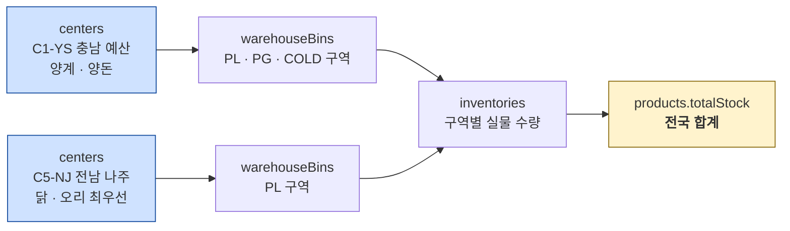
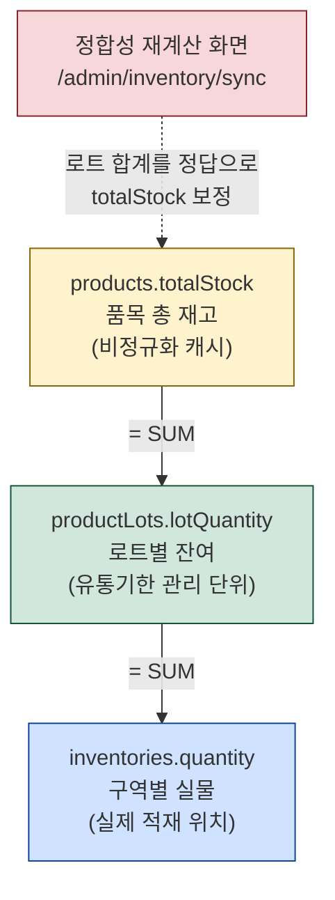
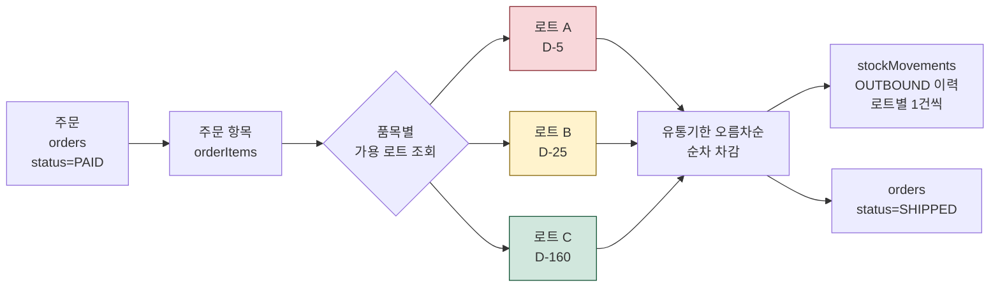
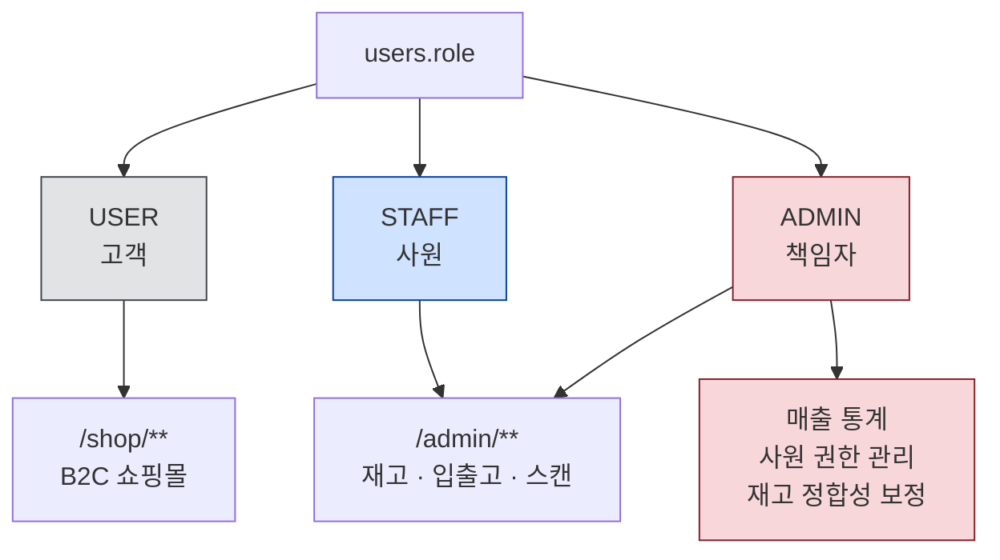
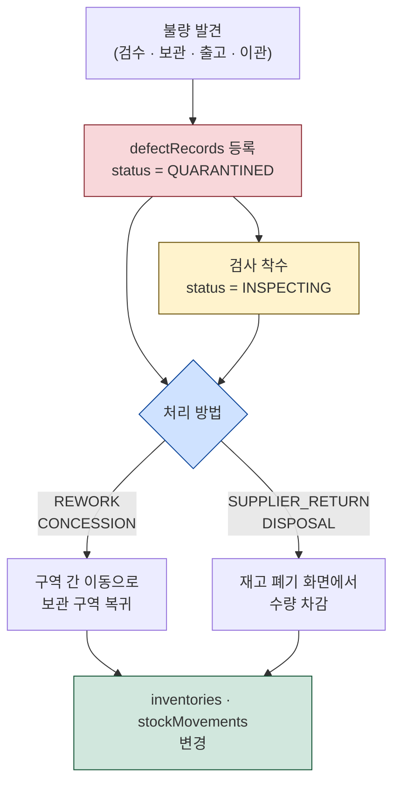

# FeedFlow ERD

배합사료 유통 관리 플랫폼 데이터 모델. B2C 쇼핑몰과 WMS(관리자 창고 시스템)가 하나의 DB를 공유한다.

- 테이블 12개 / 컬럼 132개 / 관계 16건
- 물리 명명 규칙: `PhysicalNamingStrategyStandardImpl` 적용 → **DB 컬럼도 camelCase 유지**
- 예약어 회피를 위해 `users`, `orders`, `binLevel` 만 이름을 변경

상세 정의서는 [erd-columns.tsv](erd-columns.tsv) · [erd-relations.tsv](erd-relations.tsv) · [erd-enums.tsv](erd-enums.tsv) 참고.

## 전체 ERD

```mermaid
erDiagram
    users          ||--o{ orders         : "주문한다"
    orders         ||--|{ orderItems     : "항목을 가진다"
    products       ||--o{ orderItems     : "주문된다"
    products       ||--o{ productLots    : "로트로 입고된다"
    products       ||--o{ stockMovements : "이력이 쌓인다"
    productLots    ||--o{ inventories    : "구역에 적재된다"
    productLots    |o--o{ orderItems     : "FEFO 대표 로트"
    productLots    ||--o{ stockMovements : "이력이 쌓인다"
    centers        ||--o{ warehouseBins  : "구역을 보유한다"
    centers        ||--o{ farmCustomers  : "담당 농장을 가진다"
    warehouseBins  ||--o{ inventories    : "재고를 보관한다"
    warehouseBins  |o--o{ stockMovements : "이력의 대상 구역"
    warehouseBins  |o--o{ stockMovements : "이동 이력의 출발 구역"
    manufacturers  |o--o{ products       : "공급한다"
    productLots    ||--o{ defectRecords  : "불량이 발생한다"
    warehouseBins  |o--o{ defectRecords  : "불량이 발견된 구역"

    users {
        bigint    userId    PK "IDENTITY"
        varchar   email     UK "로그인 ID"
        varchar   password     "BCrypt 해시"
        varchar   name         "NOT NULL"
        varchar   phone        "nullable"
        varchar   role         "USER / STAFF / ADMIN"
        timestamp createdAt    "NOT NULL"
    }

    manufacturers {
        bigint    manufacturerId PK "IDENTITY"
        varchar   name           UK "코드 체계가 없어 이름이 유일한 기준"
        varchar   businessNumber    "사업자등록번호 nullable"
        varchar   phone             "반품 연락처 nullable"
        varchar   contactName       "담당자 nullable"
        boolean   active            "false = 거래 중지"
        timestamp createdAt         "NOT NULL"
    }

    centers {
        bigint    centerId   PK "IDENTITY"
        varchar   centerCode UK "업무 식별자 정렬 기준"
        varchar   name          "화면 표기명 예 충남 예산 센터"
        varchar   region        "권역 예 충남 서북부"
        varchar   address       "nullable"
        varchar   note          "운영 방향 예 양계 양돈 중심"
        double    latitude      "지도 핀 위도 nullable"
        double    longitude     "지도 핀 경도 nullable"
        boolean   active        "false = 운영 중지"
        timestamp createdAt     "NOT NULL"
    }

    farmCustomers {
        bigint    farmCustomerId      PK "IDENTITY"
        varchar   farmCode            UK "업무 식별자 예 F-W01-01"
        varchar   farmName               "NOT NULL"
        varchar   representativeName     "대표자"
        varchar   phone                  "NOT NULL"
        varchar   postalCode             "NOT NULL"
        varchar   address                "NOT NULL"
        double    latitude               "농장 위도 nullable"
        double    longitude              "농장 경도 nullable"
        varchar   animalType             "CATTLE / PIG / POULTRY"
        int       livestockCount         "사육 두수"
        int       monthlyFeedQuantity    "월 예상 사료량 포대"
        varchar   preferredFeed          "담당자 설명"
        int       recurringDeliveryDay   "정기 배송일 1 ~ 28"
        bigint    centerId            FK "담당 물류센터"
        double    distanceKm             "센터까지 거리 km"
        varchar   status                 "ACTIVE / PAUSED"
        varchar   notes                  "nullable"
        timestamp createdAt              "NOT NULL"
    }

    products {
        bigint    productId     PK "IDENTITY"
        varchar   productCode   UK "업무 식별자"
        varchar   name             "NOT NULL"
        bigint    manufacturerId FK "nullable 제조사 미등록 허용"
        varchar   animalType       "CATTLE / PIG / POULTRY"
        varchar   productType      "FEED / SUPPLEMENT"
        int       weightKg         "포장 무게"
        bigint    price            "NOT NULL"
        int       totalStock       "비정규화 캐시"
        int       safetyStock      "안전재고 알림 기준"
        int       shelfLifeDays    "유통기한 자동계산용"
        boolean   active           "soft delete"
        bigint    version          "낙관적 락"
        varchar   imageUrl         "B2C 전용"
        varchar   description      "B2C 전용"
    }

    productLots {
        bigint    lotId            PK "IDENTITY"
        bigint    productId        FK "NOT NULL"
        varchar   lotNo               "복합 UK productId lotNo"
        date      manufacturedDate    "NOT NULL"
        date      expirationDate      "제조일 + shelfLifeDays"
        int       lotQuantity         "로트 잔여 수량"
        bigint    version             "낙관적 락"
    }

    warehouseBins {
        bigint    binId       PK "IDENTITY"
        varchar   binCode     UK "예 A-01-02"
        bigint    centerId    FK "소속 물류센터 NOT NULL"
        varchar   zone           "A / B / COLD"
        varchar   binPurpose     "STORAGE / RECEIVING / SHIPPING / INSPECTION"
        int       posX           "2D 도면 좌상단 열"
        int       posY           "2D 도면 좌상단 행"
        int       posWidth       "2D 도면 가로 칸 수"
        int       posHeight      "2D 도면 세로 칸 수"
        varchar   rack           "nullable"
        int       binLevel       "level 예약어 회피"
        int       maxCapacity    "적재 한도"
        boolean   active         "soft delete"
        varchar   memo           "nullable"
        timestamp createdAt      "NOT NULL"
    }

    inventories {
        bigint    inventoryId PK "IDENTITY"
        bigint    lotId       FK "복합 UK lotId binId"
        bigint    binId       FK "복합 UK lotId binId"
        int       quantity       "구역별 실물 수량"
        timestamp updatedAt      "자동 갱신"
        bigint    version        "낙관적 락"
    }

    orders {
        bigint    orderId         PK "IDENTITY"
        bigint    userId          FK "주문 고객"
        bigint    totalPrice         "할인 전"
        bigint    discountPrice      "할인액"
        bigint    finalPrice         "매출 집계 기준"
        varchar   shippingAddress    "NOT NULL"
        varchar   status             "PAID / READY / SHIPPED / DELIVERED / CANCELED"
        timestamp createdAt          "NOT NULL"
        timestamp canceledAt         "nullable 취소 일시"
        varchar   cancelReason       "nullable 취소 사유"
        bigint    canceledById       "FK 아님 처리자 스냅샷"
        varchar   canceledByName     "FK 아님 이력 보존"
    }

    orderItems {
        bigint orderItemId PK "IDENTITY"
        bigint orderId     FK "cascade ALL"
        bigint productId   FK "NOT NULL"
        bigint lotId       FK "nullable 대표 로트"
        int    quantity       "NOT NULL"
        bigint orderPrice     "주문 당시 단가"
    }

    stockMovements {
        bigint    movementId   PK "IDENTITY"
        varchar   movementType    "INBOUND / OUTBOUND / DISPOSAL / MOVE / ADJUST"
        bigint    productId    FK "NOT NULL"
        bigint    lotId        FK "NOT NULL"
        bigint    binId        FK "nullable 대상(도착) 구역"
        bigint    fromBinId    FK "nullable MOVE 출발 구역"
        int       quantity        "항상 양수"
        varchar   memo            "nullable"
        varchar   reason          "폐기 사유 enum"
        bigint    orderId         "FK 아님 주문 참조 스냅샷"
        bigint    userId          "FK 아님 처리자 스냅샷"
        varchar   userName        "FK 아님 이력 보존"
        timestamp createdAt       "NOT NULL"
    }

    defectRecords {
        bigint    defectId       PK "IDENTITY"
        varchar   defectNo       UK "DF-yyMM-NNN 월별 순번"
        bigint    lotId          FK "NOT NULL 품목이 아니라 로트 단위"
        bigint    binId          FK "nullable 이관 중은 구역 특정 불가"
        int       quantity          "포대 로트 잔여와 비교하지 않는다"
        varchar   defectType        "DAMAGE / CONTAMINATION / WET / SPECIFICATION / FOREIGN_MATTER / EXPIRED / OTHER"
        varchar   stage             "RECEIVING / STORAGE / SHIPPING / TRANSFER"
        varchar   status            "QUARANTINED / INSPECTING / RESOLVED 역행 불가"
        varchar   resolution        "nullable REWORK / CONCESSION / SUPPLIER_RETURN / DISPOSAL"
        varchar   memo              "nullable 발견 상황"
        varchar   resolutionMemo    "nullable 처리 내용"
        varchar   reportedByName    "FK 아님 발견자 스냅샷"
        varchar   resolvedByName    "FK 아님 처리자 스냅샷"
        timestamp createdAt         "NOT NULL 방치 판정 기준"
        timestamp resolvedAt        "nullable"
    }
```

## 물류센터와 구역 (Center → Bin)

원래 창고는 `Warehouse` enum(`WH1` · `WH2`) 이었다. 물류센터 한 곳 안의 건물 2동을 가리키기에는 충분했지만,
**전국 단위가 되면 센터는 운영 중에 늘고 줄어든다.** enum 은 값을 추가할 때마다 코드를 다시 배포해야 하므로
`centers` 테이블로 승격하고 `warehouseBins.centerId` 로 참조한다.

> `centerCode` 에 순번(`C1`~`C5`)을 담아 정렬 순서를 만든다. 별도 정렬 컬럼 없이
> 탭 · 선택 상자 · 분포 차트의 순서가 코드 순으로 정해진다.
>
> `zone` 은 축종 코드다 — `CT` 소 · `PG` 돼지 · `PL` 가금 · `COLD` 영양제 ·
> `R` 입고 대기 · `S` 출고 대기 · `TRANSIT` 운송 중(가상). 2D 도면만 봐도
> 그 센터의 운영 방향이 드러난다.
>
> `latitude` · `longitude` 는 **지도 핀 전용**이며 `nullable` 이다. 부지 확정 전
> 센터를 먼저 등록해 재고를 배분하는 일이 있고, 좌표가 없으면 지도에서만 빠진다.
> 주소를 화면에서 좌표로 변환(Geocoder)하지 않는 이유는 `address` 가 기획 단계에
> `"고덕면 몽곡리 667 일대"` 처럼 범위로 적혀 있어 변환 결과가 호출마다 달라질 수
> 있기 때문이다. 좌표는 파생값이 아니라 기준 정보로 둔다.

- **2D 도면은 센터 단위로 한 장씩** 그린다. 서로 떨어진 센터의 구역이 한 도면에 섞이면 실제 위치를 오해한다.
- 구역 선택 상자는 `centerCode → binCode` 순으로 정렬하고 `<optgroup>` 으로 센터를 나눈다.
  구역 코드만으로 정렬하면 김제의 `GJ-COLD-01` 이 예산의 `YS-PG-01` 보다 앞에 와, 서로 다른 센터의 구역이 뒤섞인다.
- `warehouseBins.centerId` 는 `optional = false` 다. 기본 센터를 두지 않는다 —
  센터가 여러 곳이면 '기본 센터'라는 개념 자체가 성립하지 않고, 임의로 채우면 엉뚱한 도면에 구역이 나타난다.
- `products.totalStock` 은 **센터별로 나누지 않고 전국 합계를 유지**한다.
  B2C 쇼핑몰이 이 값을 '판매 가능 수량'으로 읽고 있어 의미를 바꾸면 연동이 깨진다.
  센터별 가용 재고는 `inventories` 를 센터 기준으로 집계해서 구한다.

## 재고가 3단으로 관리되는 구조

재고 수량은 조회 성능을 위해 세 계층에 중복 저장된다. 세 값은 항상 같아야 한다.

세 계층은 입고 · 출고 · 폐기 시 **한 트랜잭션에서 함께 갱신**되고, `products` · `productLots` · `inventories` 세 엔티티에 `@Version` 낙관적 락이 걸려 있다.

## FEFO 출고 흐름

유통기한이 가장 빠른 로트부터 차감한다.

한 주문 항목이 여러 로트에 걸쳐 차감될 수 있으나 `orderItems.lotId` 는 로트를 하나만 저장할 수 있다.
그래서 **가장 먼저 만료되는 로트를 대표로 기록**하고, 로트별 실제 차감 내역은 `stockMovements` 에 남긴다.
B2C 와 공유하는 스키마를 바꾸지 않기 위한 설계다.

## 권한 구조

`users` 한 테이블에 B2C 고객과 사원이 함께 저장되고 `role` 로 구분한다.

`/admin/**` 은 `hasAnyRole("STAFF","ADMIN")`, 책임자 전용 기능은 추가로 `@PreAuthorize("hasRole('ADMIN')")` 와
Thymeleaf `sec:authorize` 로 이중 차단한다.

## 불량이 발견되면 어떻게 되는가

검수 전 재고가 출고되지 않도록 막는 것은 구역 용도(`BinPurpose`)가 한다. 그런데 **막은 다음**에
무엇을 하는지가 없었다. 어느 제조사에서 반복되는지, 어느 단계에서 잡히는지, 격리한 재고를
며칠째 방치했는지를 알 수 없었다. `defectRecords` 가 그 자리를 채운다.

**이 표가 재고 수량을 바꾸지 않는다.** 반품이나 폐기로 처리해도 `inventories` 는 그대로다.
재고를 줄이는 일은 폐기 기능 하나만 한다. 두 곳에서 줄이면 언젠가 한쪽만 고치게 되고,
그때 재고는 줄었는데 이력이 없거나 이력은 있는데 재고가 그대로인 상태가 생겨
어느 쪽이 맞는지 알 수 없어진다. 대신 처리 결과에 **다음에 할 일**(`followUp`)을 붙여
담당자를 폐기 화면으로 보낸다.

몇 가지 판단을 적어 둔다.

| 결정 | 이유 |
|---|---|
| `DefectType` 을 `DisposalReason` 과 합치지 않았다 | 4개 값이 겹치지만 묻는 것이 다르다. 불량 유형은 "무엇이 잘못됐나", 폐기 사유는 "왜 버리나". 불량이 반드시 폐기로 가지 않고(특채 · 재작업), 폐기 사유에는 실사 손실 · 샘플처럼 불량과 무관한 값이 있다. 합치면 "재고 실사 손실" 이라는 불량 유형이 생긴다. 대신 `toDisposalReason()` 매핑을 둔다 |
| 상태를 되돌릴 수 없다 | 재발을 한 건에 덮어쓰면 "이 로트에서 몇 번 나왔는가" 를 셀 수 없어 공급업체 평가 근거가 뭉개진다. 다시 나왔다면 새 건으로 등록해야 한다 |
| 품목이 아니라 **로트**를 참조한다 | 같은 품목이어도 제조 단위가 다르면 별개 문제다. 로트를 특정하지 않으면 "이 제조 단위에서 반복되는가" 를 알 수 없다 |
| `quantity` 가 로트 잔여를 넘어도 막지 않는다 | 폐기 후에도 기록은 남아야 한다. 현재 재고와 비교하는 규칙을 두면 어제 등록한 정상적인 기록이 오늘 오류가 된다 |
| `Product.manufacturer` 가 nullable 이다 | 제조사를 모르는 상태로 등록하는 실무가 있다(샘플 · 자사생산 · 등록 누락). 필수로 두면 기존 품목을 등록할 방법이 없다. 대신 제조사별 집계에서 `'미등록'` 으로 묶어 **등록이 필요하다는 사실이 화면에 드러나게** 한다 |
| `DefectStage` 에 `TRANSFER` 를 넣고 생산 · 고객 반품은 넣지 않았다 | 우리는 유통만 한다. 반품 절차는 의도적으로 만들지 않았으므로 없는 기능의 선택지를 두면 안 된다. 대신 센터 간 이관(`IN_TRANSIT`) 구간의 운송 중 파손이 실제로 있다. 결과적으로 4단계가 `BinPurpose` 와 1:1 로 대응한다 |
